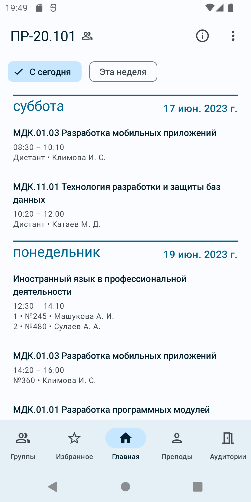
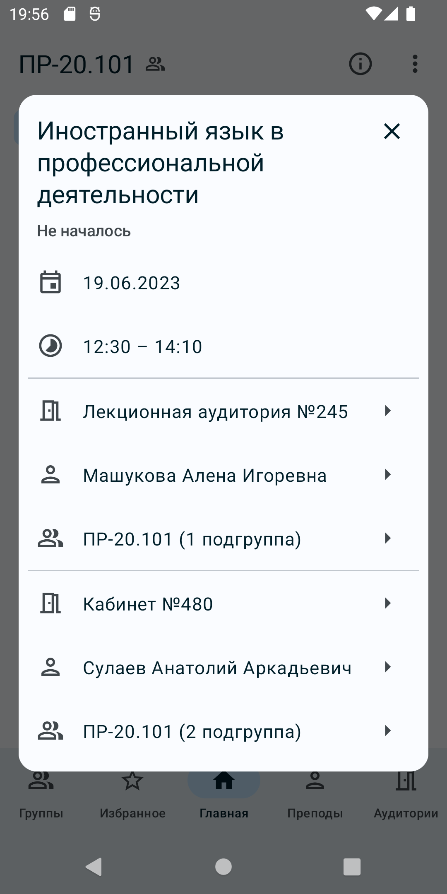
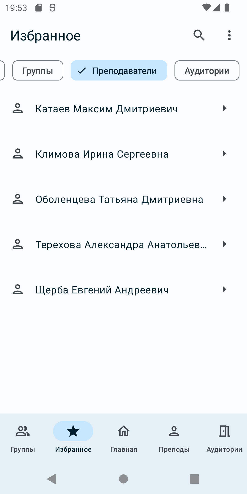
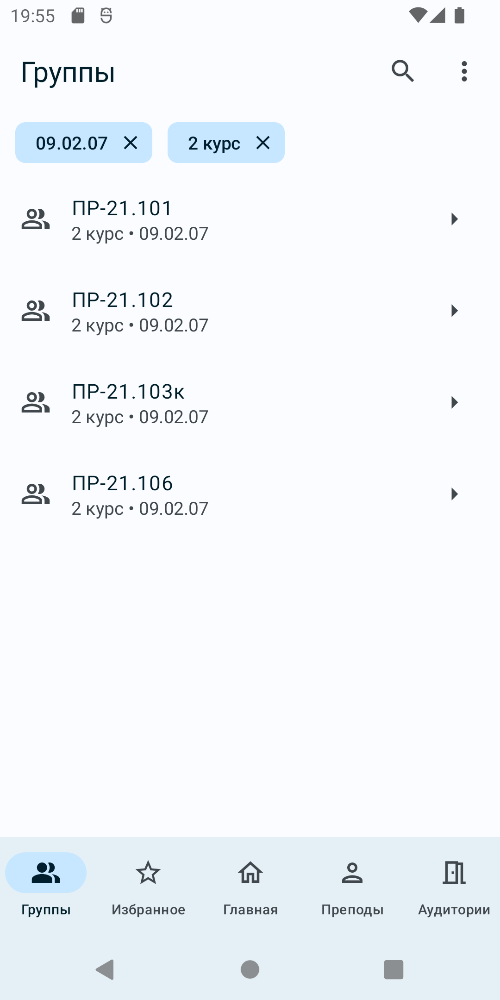

  
  <h1>Расписание НАТК</h1>
  
Android-приложение для просмотра расписания занятий групп, преподавателей и аудиторий НАТК (<a href="https://natk.ru/">Новосибирского авиационного технического колледжа имени Б. С. Галущака</a>).

## Скачать

## Скриншоты

  
  
  
  

## Функции
- Расписания групп, преподавателей и аудиторий (кабинетов);
- Главное расписание, которое отображается на домашней странице;
- Список избранных расписаний для быстрого доступа;
- Выделение текущего и следующего занятия;
- Отображение оставшегося времени до перерыва или конца занятия;
- Быстрый переход от расписания группы к расписанию аудитории, в которой идет занятие, от расписания аудиотрии к расписанию преподавателя и так далее;
- Локальное сохранение главного и избранных расписаний для оффлайн-просмотра;
- Автоматическое обновление сохраненных расписаний в фономов режиме.

## Особенности
- [Дизайн приложения](https://www.figma.com/file/n10dERdJYx375pg5hX9Wga/Schedule?type=design&node-id=0%3A1&t=aeca6OfxvEfVdKKW-1) основан на [Material 3](https://m3.material.io/);
- Архитектура приложения основана на [рекоммендациях Google/Modern App Architecture](https://developer.android.com/topic/architecture#modern-app-architecture);
- Приложение написано на языке [Kotlin](https://kotlinlang.org/);
- В приложении исползуются [корутины](https://kotlinlang.org/docs/coroutines-overview.html) и [потоки](https://kotlinlang.org/docs/flow.html) Kotlin;
- Пользовательский интерфейс приложения создан при помощи библиотеки [Jetpack Compose](https://developer.android.com/jetpack/compose);
- Для локального хранения данных используется библиотека [Room](https://developer.android.com/training/data-storage/room/);
- В приложении используется фреймворк для внедрения зависимостей [Koin](https://insert-koin.io/).

## Среда разработки и сборка
Приложение можно собрать в среде разработки [Android Studio Flamingo](https://developer.android.com/studio/releases/) или позднее.

Для сборки в файле `local.properties` в корне проекта нужно указать следующие константы:
- `DATABASE_URL` — URL для подключения к базе данных расписания колледжа;
- `DATABASE_USERNAME` — имя пользователя для подключения к базе данных расписания колледжа;
- `DATABASE_PASSWORD` — пароль для подключения к базе данных расписания колледжа.

*К сожалению, нет REST API, поэтому приходится напрямую общаться с базой данных.*

## Лицензия
Приложение распространяется по лицензии Apache License 2.0. Читайте файл [LICENSE](./LICENSE).
